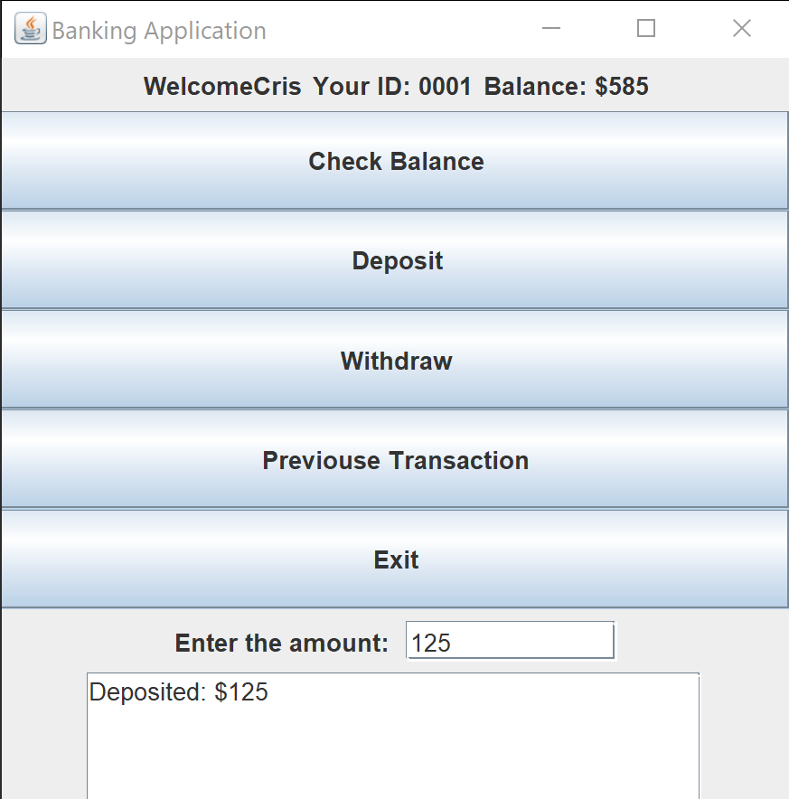

# BankingApplicationGUI

A simple Java Swing GUI application for basic banking operations such as checking balance, depositing, withdrawing, and viewing the previous transaction.

## Overview

The program simulates a bank account with the following features:

* Display current balance
* Deposit money into the account
* Withdraw money from the account
* View the previous transaction (deposit or withdrawal)
* Exit the application

## Prerequisites

* Java Development Kit (JDK) 8 or higher

## Project Structure

* `BankingApplicationGUI.java`: Contains the `main` method that creates a `BankAccount` object and launches the GUI.
* `BankAccount` class: Implements account logic and builds the Swing GUI:

  * **Fields**:

    * `int balance`: current account balance
    * `int previousTransaction`: amount of the last transaction
    * `String customerName, customerId`: customer information
  * **GUI Components**:

    * `JFrame frame`: main application window
    * `JLabel balanceLabel`: displays the current balance
    * `JTextField amountField`: input for deposit/withdrawal amounts
    * `JTextArea outputArea`: shows operation results
  * **Key Methods**:

    * `deposit(int amount)`: adds funds to the balance
    * `withdraw(int amount)`: subtracts funds from the balance
    * `getPreviousTransaction()`: prints the last transaction details
    * `updateBalance()`: refreshes the balance label
    * `showMenu()`: constructs and displays the GUI with event handlers

## Compilation and Running

1. Save the code in a file named `BankingApplicationGUI.java`.

2. Open a terminal and navigate to the directory containing the file.

3. Compile:

   ```bash
   javac BankingApplicationGUI.java
   ```

4. Run:

   ```bash
   java BankingApplicationGUI
   ```

## Screenshot

Below is the actual screenshot of the application interface:



## License

This project is licensed under the MIT License. See the [LICENSE](/LICENSE) file for details.

